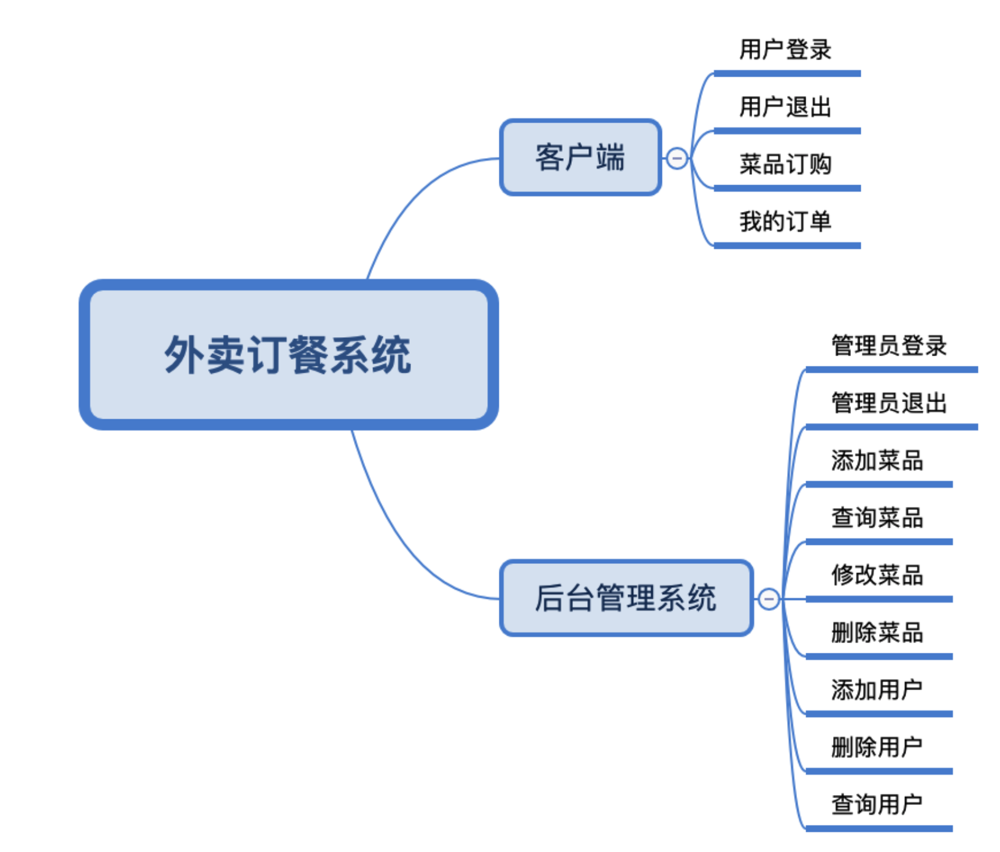
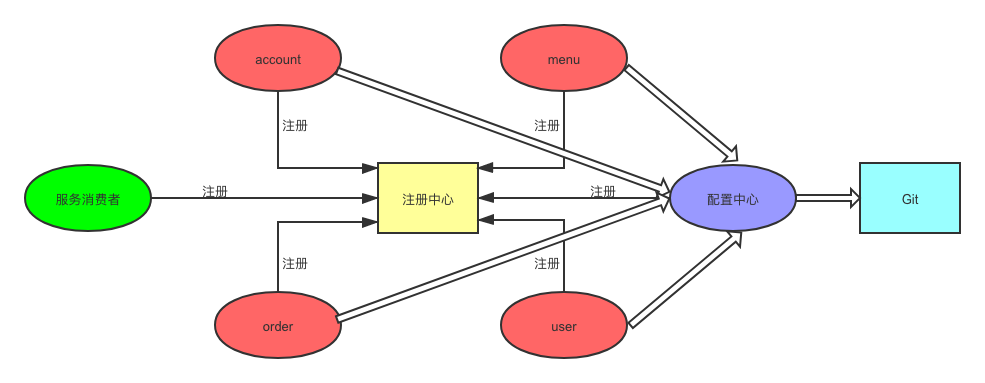

### 项目需求

客户端：针对普通用户，用户登录，用户退出，菜名订购，我的订单

后台管理系统：针对管理员，管理员登录，管理员退出，天际菜单，查询菜品，修改菜品，删除菜品，订单处理，添加用户，查询用户，删除用户

### 外卖订餐系统

- 客户端
  - 用户登录
  - 用户退出
  - 菜品订购
  - 我的订单
- 后台管理系统
  - 管理员登录
  - 管理员退出
  - 添加菜品
  - 查询菜品
  - 修改菜品
  - 删除菜品
  - 订单处理
  - 添加用户
  - 查询用户
  - 删除用户



account 提供账户服务：用户和管理的登录退出

menu 提供菜品服务：添加菜品、删除菜品、修改菜品、查询菜品

order 提供订单服务：添加订单、删除订单、查询订单、处理订单

user 提供用户服务：添加用户、删除用户、修改用户、查询用户

分离出一个服务消费者，来调用以上四个服务提供者，服务消费者包含了客户端的前端页面和后台的接口、后台管理系统的前端页面和后台接口。用户/管理员直接访问的资源都保存在服务无消费者中，服务消费者根据具体的需求调用四个服务提供者的业务逻辑，通过Feign实现负载均衡。

四个服务提供者和一份服务消费者都需要在注册中心进行注册，同时可以使用配置中来对配置文件进行统一集中管理。



- 创建父工程，pom.xml

> 说明：

`Spring Boot`和`Spring Boot`版本对应查看`https://start.spring.io/actuator/info`

```xml
<?xml version="1.0" encoding="UTF-8"?>
<project xmlns="http://maven.apache.org/POM/4.0.0"
         xmlns:xsi="http://www.w3.org/2001/XMLSchema-instance"
         xsi:schemaLocation="http://maven.apache.org/POM/4.0.0 http://maven.apache.org/xsd/maven-4.0.0.xsd">
    <modelVersion>4.0.0</modelVersion>

    <groupId>com.southwind</groupId>
    <artifactId>orderspringcloud</artifactId>
    <packaging>pom</packaging>
    <version>1.0-SNAPSHOT</version>

    <modules>
        <module>eurekaserver</module>
        <module>configserver</module>
        <module>menu</module>
    </modules>

    <properties>
        <spring.boot.version>2.0.7.RELEASE</spring.boot.version>
        <spring.cloud.version>Finchley.SR2</spring.cloud.version>
    </properties>

    <dependencies>
        <dependency>
            <groupId>org.springframework.boot</groupId>
            <artifactId>spring-boot-starter-web</artifactId>
            <version>${spring.boot.version}</version>
        </dependency>
        <dependency>
            <groupId>org.projectlombok</groupId>
            <artifactId>lombok</artifactId>
            <optional>true</optional>
        </dependency>
    </dependencies>

    <dependencyManagement>
        <dependencies>
            <dependency>
                <groupId>org.springframework.cloud</groupId>
                <artifactId>spring-cloud-dependencies</artifactId>
                <version>${spring.cloud.version}</version>
                <type>pom</type>
                <scope>import</scope>
            </dependency>
            <dependency>
                <groupId>org.springframework.boot</groupId>
                <artifactId>spring-boot-dependencies</artifactId>
                <version>${spring.boot.version}</version>
                <type>pom</type>
                <scope>import</scope>
            </dependency>
        </dependencies>
    </dependencyManagement>
</project>
```

- 创建注册中心eurekaserver，pom.xml

```xml
<?xml version="1.0" encoding="UTF-8"?>
<project xmlns="http://maven.apache.org/POM/4.0.0"
         xmlns:xsi="http://www.w3.org/2001/XMLSchema-instance"
         xsi:schemaLocation="http://maven.apache.org/POM/4.0.0 http://maven.apache.org/xsd/maven-4.0.0.xsd">
    <parent>
        <artifactId>orderspringcloud</artifactId>
        <groupId>com.southwind</groupId>
        <version>1.0-SNAPSHOT</version>
    </parent>
    <modelVersion>4.0.0</modelVersion>

    <artifactId>eurekaserver</artifactId>

    <dependencies>
        <dependency>
            <groupId>org.springframework.cloud</groupId>
            <artifactId>spring-cloud-starter-netflix-eureka-server</artifactId>
            <version>2.0.2.RELEASE</version>
        </dependency>
    </dependencies>
</project>
```

- 创建application.yml配置文件

```yaml
server:
  port: 8761

eureka:
  client:
    service-url:
      defaultZone: http://localhost:8761/eureka/
    register-with-eureka: false
    fetch-registry: false
```

> 说明：

`eureka.client.register-with-eureka`：是否将自己注册到eureka

`eureka.client.fetch-registry`：是否从其他注册中心获取配置

- 创建启动类

```java
package com.soutwind;

import org.springframework.boot.SpringApplication;
import org.springframework.boot.autoconfigure.SpringBootApplication;
import org.springframework.cloud.netflix.eureka.server.EnableEurekaServer;

/**
 * @author wuyanshen
 * @date 2020-02-06 6:24 下午
 * @discription 启动类
 */
@EnableEurekaServer
@SpringBootApplication
public class EurekaServeApplication {
    public static void main(String[] args) {
        SpringApplication.run(EurekaServeApplication.class, args);
    }
}
```

- 创建配置中心configserver，pom.xml

```xml
<?xml version="1.0" encoding="UTF-8"?>
<project xmlns="http://maven.apache.org/POM/4.0.0"
         xmlns:xsi="http://www.w3.org/2001/XMLSchema-instance"
         xsi:schemaLocation="http://maven.apache.org/POM/4.0.0 http://maven.apache.org/xsd/maven-4.0.0.xsd">
    <parent>
        <artifactId>orderspringcloud</artifactId>
        <groupId>com.southwind</groupId>
        <version>1.0-SNAPSHOT</version>
    </parent>
    <modelVersion>4.0.0</modelVersion>

    <artifactId>configserver</artifactId>

    <dependencies>
        <dependency>
            <groupId>org.springframework.cloud</groupId>
            <artifactId>spring-cloud-config-server</artifactId>
            <version>2.0.5.RELEASE</version>
        </dependency>
    </dependencies>
</project>
```

- 创建application.yml配置文件

```yaml
server:
  port: 8762
spring:
  application:
    name: configserver
  profiles:
    active: native
  cloud:
    config:
      server:
        native:
          search-locations: classpath:/shared
eureka:
  client:
    service-url:
      defaulZone: http://localhost:8761/eureka/
  instance:
    prefer-ip-address: true

```

- 在shared文件夹中创建各个微服务对应的配置文件

- 创建启动类

```java
package com.southwind;

import org.springframework.boot.SpringApplication;
import org.springframework.boot.autoconfigure.SpringBootApplication;
import org.springframework.cloud.config.server.EnableConfigServer;

/**
 * @author wuyanshen
 * @date 2020-02-06 6:37 下午
 * @discription 启动类
 */
@EnableConfigServer
@SpringBootApplication
public class ConfigServerApplication {
    public static void main(String[] args) {
        SpringApplication.run(ConfigServerApplication.class, args);
    }
}
```

- 创建服务提供者order，pom.xml

```xml
<?xml version="1.0" encoding="UTF-8"?>
<project xmlns="http://maven.apache.org/POM/4.0.0"
         xmlns:xsi="http://www.w3.org/2001/XMLSchema-instance"
         xsi:schemaLocation="http://maven.apache.org/POM/4.0.0 http://maven.apache.org/xsd/maven-4.0.0.xsd">
    <parent>
        <artifactId>orderspringcloud</artifactId>
        <groupId>com.southwind</groupId>
        <version>1.0-SNAPSHOT</version>
    </parent>
    <modelVersion>4.0.0</modelVersion>

    <artifactId>order</artifactId>

    <dependencies>
        <dependency>
            <groupId>org.springframework.cloud</groupId>
            <artifactId>spring-cloud-starter-netflix-eureka-client</artifactId>
            <version>2.0.2.RELEASE</version>
        </dependency>
        <dependency>
            <groupId>org.springframework.cloud</groupId>
            <artifactId>spring-cloud-starter-config</artifactId>
            <version>2.0.5.RELEASE</version>
        </dependency>
    </dependencies>

</project>
```

- 创建配置文件bootstrap.yml

```yaml
spring:
  application:
    name: order
  profiles:
    active: dev
  cloud:
    config:
      discovery:
        service-id: configserver
        enabled: true
      fail-fast: true
eureka:
  instance:
    prefer-ip-address: true
  client:
    service-url:
      defaultZone: http://localhost:8761/eureka/
```

- 创建启动类

```java
package com.southwind;

import org.springframework.boot.SpringApplication;
import org.springframework.boot.autoconfigure.SpringBootApplication;

/**
 * @author wuyanshen
 * @date 2020-02-07 4:27 下午
 * @discription 启动类
 */
@SpringBootApplication
public class OrderApplication {
    public static void main(String[] args) {
        SpringApplication.run(OrderApplication.class, args);
    }
}
```

- 创建controller

```java
package com.southwind.controller;

import org.springframework.beans.factory.annotation.Value;
import org.springframework.web.bind.annotation.GetMapping;
import org.springframework.web.bind.annotation.RequestMapping;
import org.springframework.web.bind.annotation.RestController;

/**
 * @author wuyanshen
 * @date 2020-02-07 4:29 下午
 * @discription 控制器
 */
@RestController
@RequestMapping("order")
public class OrderController {

    @Value("${server.port}")
    private String port;

    @GetMapping("index")
    public String index(){
        return "order的端口是："+this.port;
    }
}
```

- 创建服务提供者menu工程，pom.xml

```xml
<?xml version="1.0" encoding="UTF-8"?>
<project xmlns="http://maven.apache.org/POM/4.0.0"
             xmlns:xsi="http://www.w3.org/2001/XMLSchema-instance"
             xsi:schemaLocation="http://maven.apache.org/POM/4.0.0 http://maven.apache.org/xsd/maven-4.0.0.xsd">
        <parent>
            <artifactId>orderspringcloud</artifactId>
            <groupId>com.southwind</groupId>
            <version>1.0-SNAPSHOT</version>
        </parent>
        <modelVersion>4.0.0</modelVersion>

        <artifactId>menu</artifactId>

        <dependencies>
            <dependency>
                <groupId>org.springframework.cloud</groupId>
                <artifactId>spring-cloud-starter-netflix-eureka-client</artifactId>
                <version>2.0.2.RELEASE</version>
            </dependency>
            <dependency>
                <groupId>org.springframework.cloud</groupId>
                <artifactId>spring-cloud-starter-config</artifactId>
                <version>2.0.5.RELEASE</version>
            </dependency>
            <dependency>
                <groupId>com.baomidou</groupId>
                <artifactId>mybatis-plus-boot-starter</artifactId>
                <version>3.3.1.tmp</version>
            </dependency>
            <dependency>
                <groupId>mysql</groupId>
                <artifactId>mysql-connector-java</artifactId>
                <version>8.0.11</version>
            </dependency>
        </dependencies>
</project>
```

- 创建配置文件bootstrap.yml

```yaml
spring:
  application:
    name: menu
  profiles:
    active: dev
  cloud:
    config:
      discovery:
        service-id: configserver
        enabled: true
      fail-fast: true

eureka:
  instance:
    prefer-ip-address: true
  client:
    service-url:
      defaultZone: http://localhost:8761/eureka/

```

- 在configserver的shared文件夹下创建menu-dev.yml文件

```yml
server:
  port: 8020

spring:
  datasource:
    driver-class-name: com.mysql.cj.jdbc.Driver
    url: jdbc:mysql://localhost:3306/orderspringcloud?characterEncoding=utf8&useSSL=false&serverTimezone=Asia/Shanghai
    username: root
    password: root
    
mybatis-plus:
  mapper-locations: classpath*:/mapper/**/*.xml
  type-aliases-package: com.southwind.entity
  configuration:
    map-underscore-to-camel-case: true
    log-impl: org.apache.ibatis.logging.stdout.StdOutImpl
```

> 说明：

`mybatis-plus.mapper-localtions`：设置mybatis配置文件路径

`mybatis-plus.type-aliases-package`：设置mybatis实体类路径

`mybatis.configuration.map-underscore-to-camel-case`：开启实体类驼峰命名

Tips:

​		mybatis默认是属性名和数据库字段名一一对应的，即 
​		数据库表列：user_name 
​		实体类属性：user_name

​		但是java中一般使用驼峰命名 
​		数据库表列：user_name 
​		实体类属性：userName

​		在Springboot中，可以通过设置map-underscore-to-camel-case属性为true来开启驼峰功能。

`mybatis-plus.configuration.log-impl`：设置打印执行sql

- 创建启动类

```java
package com.soutwind;

import org.springframework.boot.SpringApplication;
import org.springframework.boot.autoconfigure.SpringBootApplication;

/**
 * @author wuyanshen
 * @date 2020-02-07 4:40 下午
 * @discription 启动类
 */
@SpringBootApplication
public class MenuApplication {
    public static void main(String[] args) {
        SpringApplication.run(MenuApplication.class, args);
    }
}
```

- 配置Mybatis Plus

```java
package com.southwind.config;

import com.baomidou.mybatisplus.extension.plugins.PaginationInterceptor;
import lombok.AllArgsConstructor;
import lombok.extern.slf4j.Slf4j;
import org.mybatis.spring.annotation.MapperScan;
import org.springframework.context.annotation.Bean;
import org.springframework.context.annotation.Configuration;

/**
 * mybatis-plus配置
 *
 * @return
 * @date 2020/2/7 5:59 下午
 * @author wuyanshen
 */
@Configuration
@MapperScan("com.southwind.mapper")
@AllArgsConstructor
@Slf4j
public class MybatisPlusConfig {

    /**
     * 分页插件
     *
     * @return PaginationInterceptor
     */
    @Bean
    public PaginationInterceptor paginationInterceptor() {
        PaginationInterceptor paginationInterceptor = new PaginationInterceptor();
        return paginationInterceptor;
    }
    
}
```

- 创建统一信息返回类

```java
package com.southwind.common;

import lombok.AllArgsConstructor;
import lombok.Data;
import lombok.NoArgsConstructor;

import java.io.Serializable;

/**
 * @author wuyanshen
 * @date 2020-02-07 5:08 下午
 * @discription 通用返回信息类
 */
@Data
@AllArgsConstructor
@NoArgsConstructor
public class Result<T> implements Serializable {

    private int code;
    private String msg;
    private int count;
    private T data;
}
```

- 新建Menu实体类

```java
package com.southwind.entity;

import com.baomidou.mybatisplus.annotation.IdType;
import com.baomidou.mybatisplus.annotation.TableField;
import com.baomidou.mybatisplus.annotation.TableId;
import com.baomidou.mybatisplus.annotation.TableName;
import java.io.Serializable;
import lombok.Data;

@Data
@TableName(value = "t_menu")
public class TMenu implements Serializable {
    @TableId(value = "id", type = IdType.AUTO)
    private Integer id;

    @TableField(value = "name")
    private String name;

    @TableField(value = "price")
    private Double price;

    @TableField(value = "flavor")
    private String flavor;

    @TableField(value = "tid")
    private Integer tid;

    private TType tType;

    private static final long serialVersionUID = 1L;
}
```

- 新建Type实体类

```java
package com.southwind.entity;

import com.baomidou.mybatisplus.annotation.IdType;
import com.baomidou.mybatisplus.annotation.TableField;
import com.baomidou.mybatisplus.annotation.TableId;
import com.baomidou.mybatisplus.annotation.TableName;
import java.io.Serializable;
import lombok.Data;

@Data
@TableName(value = "t_type")
public class TType implements Serializable {
    @TableId(value = "id", type = IdType.AUTO)
    private Integer id;

    @TableField(value = "name")
    private String name;

    private static final long serialVersionUID = 1L;
}
```

- 新建menu的Mapper

```java
package com.southwind.mapper;

import com.baomidou.mybatisplus.core.mapper.BaseMapper;
import com.baomidou.mybatisplus.core.metadata.IPage;
import com.baomidou.mybatisplus.extension.plugins.pagination.Page;
import com.southwind.entity.TMenu;

public interface TMenuMapper extends BaseMapper<TMenu> {
    IPage<TMenu> findAll(Page page);
}
```

- 新建type的mapper

```java
package com.southwind.mapper;

import com.baomidou.mybatisplus.core.mapper.BaseMapper;
import com.southwind.entity.TType;

public interface TTypeMapper extends BaseMapper<TType> {

    TType findById(long id);
}
```

- 新建menu业务接口

```java
package com.southwind.service;

import com.baomidou.mybatisplus.core.metadata.IPage;
import com.baomidou.mybatisplus.extension.plugins.pagination.Page;
import com.southwind.entity.TMenu;
import com.baomidou.mybatisplus.extension.service.IService;
public interface TMenuService extends IService<TMenu>{

    IPage<TMenu> findAll(Page page);
}
```

- 新建menu业务接口实现类

```java
package com.southwind.service.impl;

import com.baomidou.mybatisplus.core.metadata.IPage;
import com.baomidou.mybatisplus.extension.plugins.pagination.Page;
import org.springframework.stereotype.Service;
import javax.annotation.Resource;
import java.util.List;
import com.baomidou.mybatisplus.extension.service.impl.ServiceImpl;
import com.southwind.mapper.TMenuMapper;
import com.southwind.entity.TMenu;
import com.southwind.service.TMenuService;
@Service
public class TMenuServiceImpl extends ServiceImpl<TMenuMapper, TMenu> implements TMenuService{

    public IPage<TMenu> findAll(Page page) {
        return baseMapper.findAll(page);
    }
}

```

- 新建type的mapper.xml

```xml
<?xml version="1.0" encoding="UTF-8"?>
<!DOCTYPE mapper PUBLIC "-//mybatis.org//DTD Mapper 3.0//EN" "http://mybatis.org/dtd/mybatis-3-mapper.dtd">
<mapper namespace="com.southwind.mapper.TTypeMapper">
  <resultMap id="BaseResultMap" type="com.southwind.entity.TType">
    <id column="id" property="id" />
    <result column="name" property="name" />
  </resultMap>

  <select id="findById" resultType="com.southwind.entity.TType">
    select * from t_type where id = #{id}
  </select>
</mapper>
```

- 新建menu的mapper.xml

```xml
<?xml version="1.0" encoding="UTF-8"?>
<!DOCTYPE mapper PUBLIC "-//mybatis.org//DTD Mapper 3.0//EN" "http://mybatis.org/dtd/mybatis-3-mapper.dtd">
<mapper namespace="com.southwind.mapper.TMenuMapper">
  <resultMap id="BaseResultMap" type="com.southwind.entity.TMenu">
    <id column="id" jdbcType="INTEGER" property="id" />
    <result column="name" property="name" />
    <result column="price" property="price" />
    <result column="flavor" property="flavor" />
    <association property="tType"  select="com.southwind.mapper.TTypeMapper.findById" column="tid"></association>
  </resultMap>

  <select id="findAll" resultMap="BaseResultMap">
    select id,
      name,
      price,
      flavor,
      tid
    from t_menu
  </select>
</mapper>
```

- 创建controller

```java
package com.southwind.controller;

import com.baomidou.mybatisplus.core.conditions.query.QueryWrapper;
import com.baomidou.mybatisplus.core.metadata.IPage;
import com.baomidou.mybatisplus.extension.plugins.pagination.Page;
import com.southwind.common.Result;
import com.southwind.entity.TMenu;
import com.southwind.service.TMenuService;
import org.springframework.beans.factory.annotation.Autowired;
import org.springframework.beans.factory.annotation.Value;
import org.springframework.web.bind.annotation.GetMapping;
import org.springframework.web.bind.annotation.RequestMapping;
import org.springframework.web.bind.annotation.RestController;

import java.util.List;

/**
 * @author wuyanshen
 * @date 2020-02-07 4:48 下午
 * @discription 控制器
 */
@RestController
@RequestMapping("menu")
public class MenuController {

    @Value("${server.port}")
    private String port;

    @Autowired
    private TMenuService tMenuService;

    @GetMapping("index")
    public String index(){
        return "menu的端口是："+ this.port;
    }

    @GetMapping("findAll")
    public Result<List<TMenu>> findAll(long current,long size){
        Page page = new Page();
        page.setCurrent(current);
        page.setSize(size);
        IPage iPage = tMenuService.page(page);
        return new Result(0,"成功", (int)iPage.getTotal(), iPage.getRecords());
    }
}
```

- 创建服务消费者client，pom.xml

```xml
<?xml version="1.0" encoding="UTF-8"?>
<project xmlns="http://maven.apache.org/POM/4.0.0"
         xmlns:xsi="http://www.w3.org/2001/XMLSchema-instance"
         xsi:schemaLocation="http://maven.apache.org/POM/4.0.0 http://maven.apache.org/xsd/maven-4.0.0.xsd">
    <parent>
        <artifactId>orderspringcloud</artifactId>
        <groupId>com.southwind</groupId>
        <version>1.0-SNAPSHOT</version>
    </parent>
    <modelVersion>4.0.0</modelVersion>

    <artifactId>client</artifactId>

    <dependencies>
        <dependency>
            <groupId>org.springframework.cloud</groupId>
            <artifactId>spring-cloud-starter-netflix-eureka-client</artifactId>
            <version>2.0.2.RELEASE</version>
        </dependency>
        <dependency>
            <groupId>org.springframework.cloud</groupId>
            <artifactId>spring-cloud-starter-openfeign</artifactId>
            <version>2.0.2.RELEASE</version>
        </dependency>
        <dependency>
            <groupId>org.springframework.cloud</groupId>
            <artifactId>spring-cloud-starter-config</artifactId>
            <version>2.0.5.RELEASE</version>
        </dependency>
        <dependency>
            <groupId>org.springframework.boot</groupId>
            <artifactId>spring-boot-starter-thymeleaf</artifactId>
            <version>2.0.2.RELEASE</version>
        </dependency>
    </dependencies>
</project>
```

- 创建配置文件bootstrap.yml

```yaml
spring:
  application:
    name: client
  profiles:
    active: dev
  cloud:
    config:
      discovery:
        service-id: configserver
        enabled: true
      fail-fast: true
```

- 在shared中新建client-dev.yml

```yaml
server:
  port: 8030
spring:
  thymeleaf:
    prefix: classpath:/static/
    suffix: .html
eureka:
  client:
    service-url: http://localhost:8761/eureka/
  instance:
    prefer-ip-address: true
```

- 创建启动类

```java
package com.southwind;

import org.springframework.boot.SpringApplication;
import org.springframework.boot.autoconfigure.SpringBootApplication;
import org.springframework.cloud.openfeign.EnableFeignClients;

/**
 * @author wuyanshen
 * @date 2020-02-07 11:06 下午
 * @discription 启动类
 */
@SpringBootApplication
@EnableFeignClients
public class ClientApplication {
    public static void main(String[] args) {
        SpringApplication.run(ClientApplication.class, args);
    }
}
```

- 新建controller

```java
package com.southwind.controller;

import com.baomidou.mybatisplus.extension.plugins.pagination.Page;
import com.southwind.common.Result;
import com.southwind.entity.TMenu;
import com.southwind.feign.MenuFeign;
import org.springframework.beans.factory.annotation.Autowired;
import org.springframework.web.bind.annotation.GetMapping;
import org.springframework.web.bind.annotation.RequestMapping;
import org.springframework.web.bind.annotation.RestController;

import java.util.List;

/**
 * @author wuyanshen
 * @date 2020-02-07 11:17 下午
 * @discription 控制器
 */
@RestController
@RequestMapping("client")
public class ClientController {

    @Autowired
    private MenuFeign menuFeign;

    @GetMapping("findAll")
    public Result<List<TMenu>> findAll(long page,long limit){
       return menuFeign.findAll(page,limit);
    }
}
```

> 说明：

这里的page和limit是和layui中要求的参数做对应

- 创建feign接口

```java
package com.southwind.feign;

import com.southwind.common.Result;
import com.southwind.entity.TMenu;
import org.springframework.cloud.openfeign.FeignClient;
import org.springframework.web.bind.annotation.GetMapping;
import org.springframework.web.bind.annotation.RequestParam;

import java.util.List;

@FeignClient(value = "menu")
public interface MenuFeign {

    @GetMapping("/menu/findAll")
    Result<List<TMenu>> findAll(@RequestParam("current") long current, @RequestParam("size")long size);
}
```

> 说明：

在feign接口中，参数必须用`@RequestParam`修饰，否则会被Feign当做request body来处理，只要有body，就会被Feign认为是post请求，所以整个服务是被当做带有body的post请求发送出去的，会导致调用时明明就是GET请求但是就会报一个`Request method 'POST' not supported`的错误。

- 新建页面index.html

```html
<!DOCTYPE html>
<html xmlns:th="http://www.thymeleaf.org">
<html lang="en">
<head>
    <meta charset="UTF-8">
    <title>Title</title>
    <link rel="stylesheet" th:href="@{/layui/css/layui.css}" media="all">
</head>
<body>
<div class="layui-container" style="width: 850px;height: 600px;margin-top: 0px;padding-top: 60px;">
    <div style="margin-left: 680px; width: 200px;">
        欢迎回来！<button class="layui-btn layui-btn-warm layui-btn-radius">退出</button></a>
    </div>
    <a class="layui-btn layui-btn-xs" id="productAdd">新增</a>
    <table class="layui-hide" id="menuTable" lay-filter="test"></table>
    <script th:src="@{/js/jquery-3.4.1.min.js}"></script>
    <script th:src="@{/layui/layui.js}"></script>
    <script th:inline="none">
        layui.use('table', function(){
            var table = layui.table;

            //第一个实例
            table.render({
                elem: '#menuTable'
                ,url: '/menu/findAll' //数据接口
                ,page: true //开启分页
                ,cols: [[{field: 'id', title: 'ID',width:50, sort: true, fixed: 'left'} //表头
                    ,{field: 'name', title: '菜名', width:300,}
                    ,{field: 'price', title: '单价', sort: true}
                    ,{field: 'flavor', title: '口味', width:100}
                    ,{field:'tid', title: '分类',templet:function(data){
                            return data.ttype.name
                        }
                    }
                    ,{fixed: 'right', title: '操作', width: 200, fixed: 'right', align:'center', toolbar: '#toolbar'}
                ]]
            });

            //监听行工具事件
            table.on('tool(test)', function(obj){
                var data = obj.data;
                if(obj.event === 'update'){
                    layer.open({
                        title: "修改菜品",
                        type: 2,
                        area: ['500px','400px'],
                        moveType: 1,
                        closeBtn: 2,
                        skin: 'layui-layer-rim', //加上边框
                        content: '/menu/preUpdate/'+data.id //这里content是一个普通的String
                    });
                }else if (obj.event === 'delete'){
                    layer.confirm('确定要删除吗？', function (index) {
                        window.location.href="/menu/delete/"+data.id;
                        layer.close(index)
                    })
                }
            });

            $("#productAdd").click(function(){
                layer.open({
                    title: "新增菜品",
                    type: 2,
                    area: ['500px','400px'],
                    closeBtn: 2,
                    skin: 'layui-layer-rim', //加上边框
                    content: '/menu/preAdd' //这里content是一个普通的String
                });
            });
        });
    </script>

    <script type="text/html" id="toolbar">
        <a class="layui-btn layui-btn-xs" lay-event="update">修改</a>
        <a class="layui-btn layui-btn-xs" lay-event="order">订购</a>
        <a class="layui-btn layui-btn-xs layui-btn-danger" lay-event="delete">删除</a>
    </script>
</div>

</body>
</html>
```

> 说明：

`<script th:inline="none">`：行内的javascript必须加上th:inline="none"，否则thymeleaf识别不了行内的js
